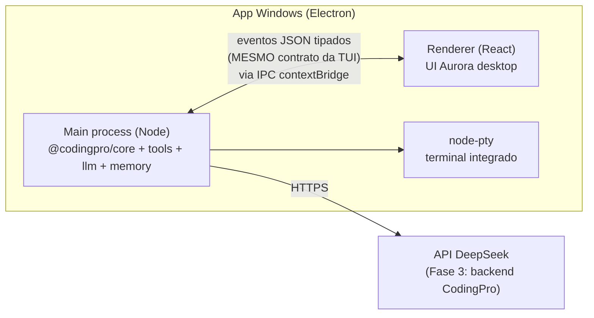

# F2-01 — Arquitetura do App Windows

## Decisão principal: Electron

| Opção | Veredito |
|---|---|
| **Electron** ✅ | O core do CodingPro **é Node/TS** — no Electron ele roda nativo no main process, sem ponte nenhuma. O Álvaro já domina Electron (Íris, Ares, hermes-desktop) — risco baixo |
| Tauri | App menor, mas core Node viraria *sidecar* com IPC extra (complexidade sem ganho real aqui) |
| WebView2 + serviço | Reinventa o Electron na mão |

## Diagrama de processos

- **Main process:** hospeda o core exatamente como a CLI faz — loop agêntico, tools, permissões, memória, subagentes (child processes normais).
- **Renderer:** React consumindo o **mesmo protocolo de eventos core↔UI da Fase 1** (turno, tool_call, permissão, progresso…). A TUI Ink e o renderer Electron são irmãos consumindo o mesmo contrato — manter isso é a regra nº 1 da fase.
- **IPC:** `contextBridge` + canal tipado (espelho do `events.ts` do core); `nodeIntegration: false`, `contextIsolation: true`.
- **Terminal integrado:** xterm.js + node-pty (PowerShell) — o usuário vê/roda comandos dentro do app.

## Suporte Windows nativo (trabalho no CORE, herdado pela CLI também)

A Fase 1 assume Linux/macOS (Windows via WSL). A Fase 2 paga essa dívida no core — e de brinde a **CLI** passa a rodar nativa no Windows:

- [ ] **Shell adapter:** tool `bash` vira `shell` com backend por plataforma — PowerShell 7 (pwsh) preferido, `powershell.exe` fallback; deny-list e parsing de comandos revisados p/ sintaxe PS
- [ ] **Paths:** `path.win32`, drives (`C:\`), UNC, espaços/acentos; repo-sombra e checkpoints git testados em NTFS
- [ ] **Binários:** ripgrep/whisper/piper têm builds Windows — ajustar downloader por plataforma
- [ ] **node:sqlite / tree-sitter WASM:** funcionam em Windows sem compilação — validar em spike
- [ ] **Git:** exigir Git for Windows; detectar e orientar na instalação
- [ ] **Notificações:** Notification API do Windows em vez de notify-send
- [ ] **Config:** `%APPDATA%\CodingPro` no lugar de `~/.codingpro` (camada de paths por plataforma)

## Integração com a config existente

- Mesmo formato `settings.json`/skills/memória da CLI — quem usa os dois compartilha tudo.
- LLM de código: permanece exclusivamente DeepSeek V4 Pro/Flash. A Fase 2 começa com acesso direto
  por chave; quando a Fase 3 existir, o login apenas troca o transporte para o proxy autenticado
  do CodingPro, sem criar outro provider ou liberar outros modelos.

## Checklist de especificação

- [ ] Congelar o contrato de eventos core↔UI como **API pública interna** (versionada) antes de W0
- [ ] Spike: core rodando em main process do Electron com um chat mínimo
- [ ] Spike: PowerShell adapter executando os cenários da lista de tortura da Fase 1
- [ ] Decidir monorepo: app entra como `packages/desktop` no mesmo repo da CLI
