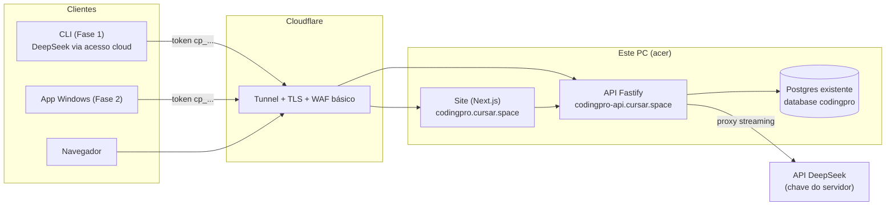

# F3-01 — Arquitetura da Plataforma

## Visão geral

## O coração: proxy LLM com medição

Endpoint `POST /v1/chat` (wire contract OpenAI-compatible, espelhando a LLM Layer da Fase 1):

1. Autentica token do usuário (`cp_...`) → carrega limites/estado.
2. **Pré-checagem:** limite estourado → `402` com mensagem clara em pt-BR (a CLI mostra bonito).
3. Repassa a chamada ao DeepSeek **com streaming passthrough** (latência quase zero adicionada) usando a chave do servidor.
4. Ao final do stream, lê o `usage` real da resposta (input, output, cache-hit) → grava consumo no Postgres (append-only) → atualiza contadores.
5. Aplica também **rate limit** (req/min) e **teto de concorrência** por usuário.

Decisões:

- **Passthrough burro por design**: o backend NÃO guarda prompts/código dos usuários (privacidade + LGPD + disco); persiste só metadados de uso (tokens, modelo, timestamps, custo). Log de conteúdo é **opt-in de debug** com retenção curta e aviso.
- O proxy aceita somente `deepseek-v4-pro` e `deepseek-v4-flash`; qualquer outro ID é rejeitado.
- A CLI continua funcionando com **chave própria do usuário** se ele preferir (acesso direto à
  mesma API DeepSeek) — a plataforma muda somente autenticação e transporte.
- Experiência prévia reaproveitada: o conceito é o mesmo do **Painel de Limites** que o Álvaro já operou com o Vertex (`LIMITS_PANEL_URL` + secret de agente) — agora feito produto.

## Site (Next.js)

- **Landing** em pt-BR: o que é, GIF/asciinema da CLI, download (CLI npm + .exe da Fase 2), preços/planos (quando existirem).
- **Cadastro/login:** e-mail + senha (argon2id) + verificação de e-mail; 2FA TOTP opcional (obrigatório p/ admin).
- **Dashboard do usuário:** consumo do mês (tokens/US$ e % do limite), gráfico diário, gerar/revogar **token da CLI**, instruções de `codingpro login`.
- **Painel admin** (doc 03): usuários, limites, consumo global, custo real na DeepSeek.

## Login na CLI (`codingpro login`)

1. CLI abre `codingpro.cursar.space/device` no navegador com código curto (device flow simples).
2. Usuário logado aprova → backend emite token `cp_...` (hash no banco, mostrado 1×).
3. CLI grava em `~/.codingpro/credentials.json` (chmod 600) e ativa `access.mode = cloud`; o
   provider permanece DeepSeek.
4. `codingpro logout` revoga no servidor.

## Stack

| Camada | Escolha | Justificativa |
|---|---|---|
| API | **Fastify + TS** (Node 24) | Mesmo idioma do resto; streaming SSE maduro; leve p/ este PC |
| Site | **Next.js** | Padrão que o Álvaro já usa nos painéis (AquiResolve); SSR p/ landing |
| Banco | **Postgres existente** + Drizzle ORM | Sem serviço novo; migrations versionadas |
| Auth | Sessões (site) + tokens opacos `cp_...` (CLI) | Simples, revogável; sem JWT stateless p/ poder cortar na hora |
| Deploy | systemd + Cloudflare Tunnel (doc 02) | Padrão da casa |

## Checklist de especificação

- [ ] Contrato OpenAPI do `/v1/chat` (wire contract OpenAI-compatible) + endpoints de conta
- [ ] Formato do erro de limite (`402`) que a CLI/app renderizam em pt-BR com "quanto falta e quando renova"
- [ ] Política de privacidade e termos (pt-BR, LGPD: dados mínimos, sem retenção de prompts)
- [ ] Decidir contagem: por tokens ou por custo US$ (recomendo **custo US$** — cache-hit barato vira incentivo natural)
