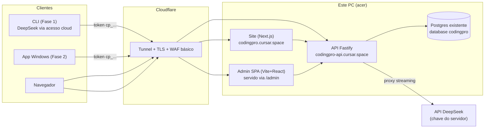

# F3-01 — Arquitetura da Plataforma

## Visão geral

## Separação de responsabilidades: 3 zonas, não 1 monolito

O front-end da plataforma é dividido em **3 zonas com responsabilidades e entregas independentes**:

| Zona | O que é | Quem acessa | Stack | Subdomínio |
|---|---|---|---|---|
| **Landing + cadastro** | Site público pt-BR, institucional, login/signup | Visitantes, usuários | Next.js (SSR) | `codingpro.cursar.space` |
| **Dashboard do usuário** | Consumo, tokens CLI, gráfico, perfil | Usuários logados | Next.js (área logada) | `codingpro.cursar.space/dashboard` |
| **Painel admin** | Usuários, limites, saúde, auditoria, kill switch | **Só o Álvaro** | **Vite + React + shadcn/ui (SPA standalone)** | Servido em `/admin` pela API |

### Por que admin como SPA standalone e não integrado ao Next.js

| Fator | Next.js (integrado) | Vite + React (standalone) |
|---|---|---|
| SSR necessário? | Não — admin é protegido por auth, não indexável | ✅ Sem SSR = menos CPU no PC compartilhado |
| Build independente | ❌ Mexer no admin recompila a landing | ✅ Deploy de um não afeta o outro |
| Serviço extra | ❌ Mesmo processo Next.js | ✅ Servido estaticamente pelo Fastify (`@fastify/static`), zero systemd extra |
| Velocidade de dev | Lento (RSC, compilação) | ✅ Vite HMR instantâneo |
| Peso no PC | Mais memória (Next.js + RSC) | ✅ `index.html` + JS/CSS estáticos, sem overhead |
| Ecossistema | React (mesmo) | ✅ React + TypeScript + Tailwind — nada novo |

**Decisão:** Admin é **Vite + React 19 + shadcn/ui**, build output `dist/` servido pelo Fastify em `/admin`. Sem serviço systemd adicional. A landing e o dashboard continuam em Next.js (SSR útil para landing pública e SEO).

### Diretriz de UI do admin

> **Funcional > bonito.** Componentes shadcn/ui default (sem customização pesada de tema), validação de formulários básica, sem animações, sem modo escuro dedicado (herda do sistema). O admin é ferramenta de trabalho do Álvaro — se cumprir a função com clareza, está pronto.

## O coração: proxy LLM com medição

Endpoint `POST /v1/chat` (wire contract OpenAI-compatible, espelhando a LLM Layer da Fase 1):

1. Autentica token do usuário (`cp_...`) → carrega limites/estado.
2. **Pré-checagem:** limite estourado → `402` com mensagem clara em pt-BR (a CLI mostra bonito).
3. Repassa a chamada ao DeepSeek **com streaming passthrough** (latência quase zero adicionada) usando a chave do servidor.
4. Ao final do stream, lê o `usage` real da resposta (input, output, cache-hit) → grava consumo no Postgres (append-only) → atualiza contadores.
5. Aplica também **rate limit** (req/min) e **teto de concorrência** por usuário.

Decisões:

- **Passthrough burro por design**: o backend NÃO guarda prompts/código dos usuários (privacidade + LGPD + disco); persiste só metadados de uso (tokens, modelo, timestamps, custo). Log de conteúdo é **opt-in de debug** com retenção curta e aviso.
- O proxy aceita somente `deepseek-v4-pro` e `deepseek-v4-flash`; qualquer outro ID é rejeitado.
- A CLI continua funcionando com **chave própria do usuário** se ele preferir (acesso direto à
  mesma API DeepSeek) — a plataforma muda somente autenticação e transporte.
- Experiência prévia reaproveitada: o conceito é o mesmo do **Painel de Limites** que o Álvaro já operou com o Vertex (`LIMITS_PANEL_URL` + secret de agente) — agora feito produto.

## Site público + dashboard (Next.js)

- **Landing** em pt-BR: o que é, GIF/asciinema da CLI, download (CLI npm + .exe da Fase 2), preços/planos (quando existirem).
- **Cadastro/login:** e-mail + senha (argon2id) + verificação de e-mail; 2FA TOTP opcional (obrigatório p/ admin).
- **Dashboard do usuário:** consumo do mês (tokens/US$ e % do limite), gráfico diário, gerar/revogar **token da CLI**, instruções de `codingpro login`.

## Painel admin (Vite + React standalone)

Ver especificação completa no doc [03_contas_limites_admin.md](03_contas_limites_admin.md). Resumo:

- **Stack:** Vite 6 + React 19 + shadcn/ui (Tailwind) + TanStack Table + Recharts + React Query
- **Auth gate:** `GET /api/admin/check` no boot do SPA → valida sessão + role admin + 2FA; redireciona se falhar
- **Servido via:** `@fastify/static` na rota `/admin` (mesmo processo da API, porta 8700)
- **Telas:** usuários, consumo, saúde, auditoria, kill switch

## Login na CLI (`codingpro login`)

1. CLI abre `codingpro.cursar.space/device` no navegador com código curto (device flow simples).
2. Usuário logado aprova → backend emite token `cp_...` (hash no banco, mostrado 1×).
3. CLI grava em `~/.codingpro/credentials.json` (chmod 600) e ativa `access.mode = cloud`; o
   provider permanece DeepSeek.
4. `codingpro logout` revoga no servidor.

## Stack

| Camada | Escolha | Justificativa |
|---|---|---|
| API | **Fastify + TS** (Node 24) | Mesmo idioma do resto; streaming SSE maduro; leve p/ este PC |
| Site | **Next.js** | Padrão que o Álvaro já usa nos painéis (AquiResolve); SSR p/ landing |
| Admin | **Vite + React 19 + shadcn/ui** | SPA standalone sem SSR; servido estaticamente pelo Fastify; zero serviço extra |
| Banco | **Postgres existente** + Drizzle ORM | Sem serviço novo; migrations versionadas |
| Auth | Sessões (site) + tokens opacos `cp_...` (CLI) | Simples, revogável; sem JWT stateless p/ poder cortar na hora |
| Deploy | systemd + Cloudflare Tunnel (doc 02) | Padrão da casa |

## Checklist de especificação

- [ ] Contrato OpenAPI do `/v1/chat` (wire contract OpenAI-compatible) + endpoints de conta
- [ ] Formato do erro de limite (`402`) que a CLI/app renderizam em pt-BR com "quanto falta e quando renova"
- [ ] Política de privacidade e termos (pt-BR, LGPD: dados mínimos, sem retenção de prompts)
- [ ] Decidir contagem: por tokens ou por custo US$ (recomendo **custo US$** — cache-hit barato vira incentivo natural)
