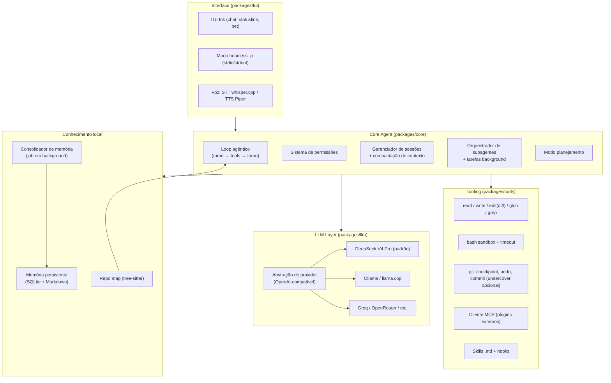

# 02 — Arquitetura

Arquitetura modular em processo único Node.js (com child processes para subagentes e voz). Nenhum serviço residente obrigatório: tudo nasce e morre com o comando `codingpro`.

## Diagrama de componentes

## Fluxo do loop agêntico (coração da CLI)

1. Usuário envia prompt (texto ou voz transcrita).
2. `SessionManager` monta a janela de contexto: system prompt + memória relevante + repo map + histórico (compactado se preciso).
3. `LLM Layer` chama o modelo com a lista de tools (function calling OpenAI-compatível).
4. Se o modelo pede tool: `PermissionSystem` avalia → executa → resultado volta ao modelo. Repete até o modelo responder texto final.
5. Toda edição de arquivo gera **checkpoint git** antes de aplicar (undo instantâneo).
6. Fim do turno: sessão persistida em disco; eventos alimentam gamificação e fila do consolidador de memória.

## Decisões de arquitetura e justificativas

| Decisão | Justificativa |
|---|---|
| **Monorepo pnpm com packages** (`core`, `tui`, `tools`, `llm`, `memory`, `voice`) | Testar o core sem UI; permitir no futuro reusar o core em outra interface (ex.: bot) sem reescrever |
| **Core desacoplado da TUI** (core emite eventos, TUI renderiza) | O mesmo core serve o modo interativo, o headless `-p` e subagentes |
| **Subagentes = child process do próprio binário** (`codingpro --agent-mode`) | Isolamento real de contexto e de crash; orquestração local sem infra extra; comunicação por stdio JSON-RPC |
| **Tools nativas em TS + tools externas via MCP** | Núcleo rápido e auditável; extensibilidade sem tocar no core |
| **Estado em `~/.codingpro/` (global) e `.codingpro/` (projeto)** | Espelha convenção consagrada (git, direnv); fácil de inspecionar/apagar/versionar |
| **SQLite (`node:sqlite`) para índices/sessões + Markdown para memória legível** | SQLite = busca e metadados; Markdown = usuário pode ler/editar a memória na mão |
| **Checkpoints via git (stash/ref oculta), não cópia de arquivos** | Barato, atômico, funciona em qualquer repo; projetos sem git ganham repo-sombra em `.codingpro/shadow-git` |
| **Sem daemon obrigatório** | "Local puro" de verdade; jobs de background (consolidação de memória) rodam oportunisticamente ao fim de sessões ou via `codingpro maintenance` |

## Adaptação local dos conceitos "de nuvem"

| Conceito (inspiração) | Adaptação local no CodingPro |
|---|---|
| Agente em background remoto | Child process local + notificação desktop (`notify-send`) ao concluir |
| Planejamento remoto p/ tarefas pesadas | Modo planejamento local: subagente "arquiteto" com reasoning alto produz plano .md; execução só após aprovação |
| Consolidação de memória em nuvem | Job local pós-sessão que resume/deduplica/liga memórias (ver doc 06) |
| Orquestração multi-agente | Orquestrador local com N child processes paralelos + merge de resultados (ver doc 05) |

## Contratos internos (a especificar na F0)

- [ ] Esquema JSON dos eventos core→UI (turno, tool_call, tool_result, permissão, progresso)
- [ ] Interface `Tool` (nome, schema JSON, execute, nível de risco)
- [ ] Interface `Provider` (chat streaming, tool calling, contagem de tokens, custo)
- [ ] Formato do arquivo de sessão (JSONL append-only)
- [ ] Formato de memória (frontmatter + corpo, igual convenção já usada pelo Álvaro)
- [ ] Protocolo orquestrador↔subagente (JSON-RPC sobre stdio)
